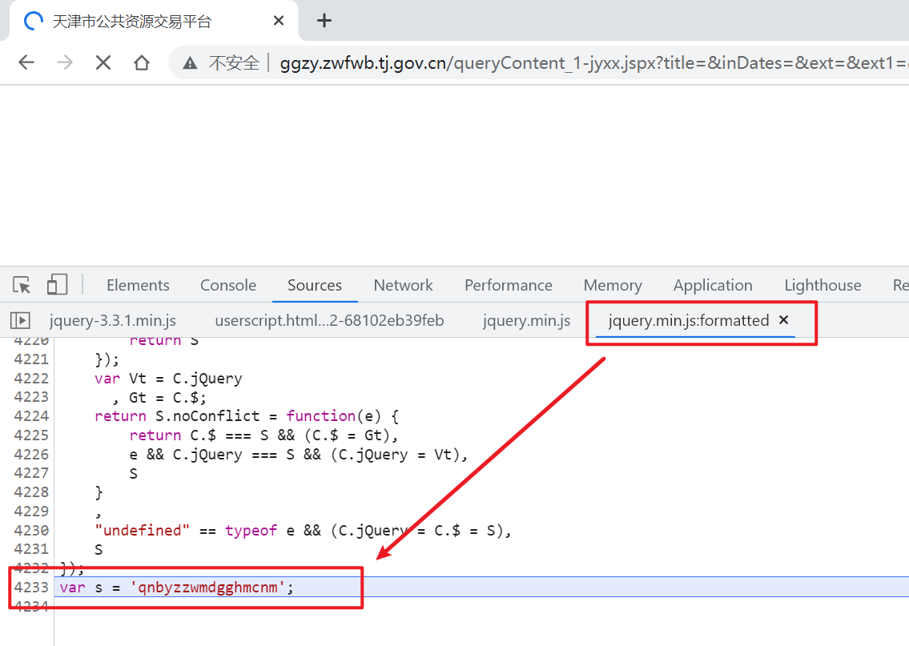

# 天津市公共资源交易平台

目标网址：

```
http://ggzy.zwfwb.tj.gov.cn/queryContent_1-jyxx.jspx?title=&inDates=&ext=&ext1=&origin=&channelId=83&beginTime=&endTime=
```

列表页中的HTML源码里的详情页的链接：


和点进去的详情页的链接不一样：


列表页：

```
http://ggzy.zwfwb.tj.gov.cn:80/jyxxzbjb/1002083.jhtml
```

详情页：

```
http://ggzy.zwfwb.tj.gov.cn/jyxxzbjb/%5EQY3iqQ7+y9zTRLVZgN41g.jhtml
```

猜测可能是在a上设置了单击事件，单击的时候通过JS进行的链接转换，查看列表页的a上绑定的事件：


这就很尴尬，因为是通过jQuery绑定的事件，所以这里查看显示的都是jQuery的，看不到真实的绑定的函数，借助于这个库：

```
https://github.com/JSREI/jQuery-hook
```

实现对jQuery绑定的事件的真实函数的暴露，安装好插件后刷新页面，可以看到此元素上使用jQuery绑定了一个click的事件函数，此函数已经赋值到`window.cc11001100_click_7`上：


控制台上输入`cc11001100_click_7`：


单击函数跟进去：


这个地方就是链接进行转换的地方，可以看到这个思路比较奇特，别的地方人家都是解密，它直接是加密，啊哈哈哈还挺有意思的：

```js
$("a").bind('click', function() {
    var hh = $(this).attr("href");
    if (typeof (hh) == 'undefined' || hh == '#') {
        hh = $(this).attr("url");
        if (typeof (hh) == 'undefined' || hh == '#') {
            return
        }
    }
    var aa = hh.split("/");
    var aaa = aa.length;
    var bbb = aa[aaa - 1].split('.');
    var ccc = bbb[0];
    var cccc = bbb[1];
    var r = /^\+?[1-9][0-9]*$/;
    var ee = $(this).attr('target');
    if (r.test(ccc) && cccc.indexOf('jhtml') != -1) {
        var srcs = CryptoJS.enc.Utf8.parse(ccc);
        var k = CryptoJS.enc.Utf8.parse(s);
        var en = CryptoJS.AES.encrypt(srcs, k, {
            mode: CryptoJS.mode.ECB,
            padding: CryptoJS.pad.Pkcs7
        });
        var ddd = en.toString();
        ddd = ddd.replace(/\//g, "^");
        ddd = ddd.substring(0, ddd.length - 2);
        var bbbb = ddd + '.' + bbb[1];
        aa[aaa - 1] = bbbb;
        var uuu = '';
        for (i = 0; i < aaa; i++) {
            uuu += aa[i] + '/'
        }
        uuu = uuu.substring(0, uuu.length - 1);
        if (typeof (ee) == 'undefined') {
            window.location = uuu
        } else {
            window.open(uuu)
        }
    } else {
        if (typeof (ee) == 'undefined') {
            window.location = hh
        } else {
            window.open(hh)
        }
    }
    return false
});
```

上面的加密中使用的这个s作为秘钥，但是这个s是个全局变量，所以还需要搞清楚它是怎么来的：

```js
        var srcs = CryptoJS.enc.Utf8.parse(ccc);
        var k = CryptoJS.enc.Utf8.parse(s);
        var en = CryptoJS.AES.encrypt(srcs, k, {
            mode: CryptoJS.mode.ECB,
            padding: CryptoJS.pad.Pkcs7
        });
```

使用这个插件定位到`s`赋值的地方：

```
https://github.com/JSREI/js-window-monitor-debugger-hook
```

啊哈哈他还挺狡猾，把这个`s`放到了`jquery.min.js`的最后一行： 



分析完毕。


